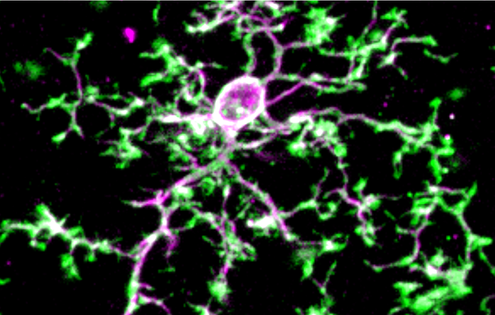

I received my B.S. in Psychology and Neuroscience from Allegheny College in 2019. While there, I worked with Dr. Jeffrey Cross and Dr. Jeffrey Hollerman studying the effects of prenatal valproic acid exposure (environmental toxin) impacts the brain and behavior in rats. I also participated in two summer research fellowships and the University of Pittsburgh with Dr. Michael Palladino where I studied mitochondrial encephalomyopathies in fruit flies, and with Dr. Caroline Runyan where we studied sensory integration in mice.

Following my undergraduate, I joined the Psychology and Neuroscience program at Duke University. As a member of Staci Bilbo's lab, my primary interests are focused on how the immune system (specifically microglial cells in the brain) interacts with the brain in development and disease. Outside of research, I am passionate about teaching in the classroom, mentoring in the lab, and making data more accessible to other scientists and the public.

---

 
This is an image showing a microglia, my favorite cell type in the brain. These little cells are the resident macrophages (immune cells) in the brain and can serve many different functions that are important for its survival. In addition to cleaning up debris and protecting the brain from infection, more recent studies have demonstrated that microglia are crucial for refining and maintaining connections between neurons. These cells control this process, which is a necessary step in neurodevelopment, but can be dangerous in cases of neurodegeneration.  
