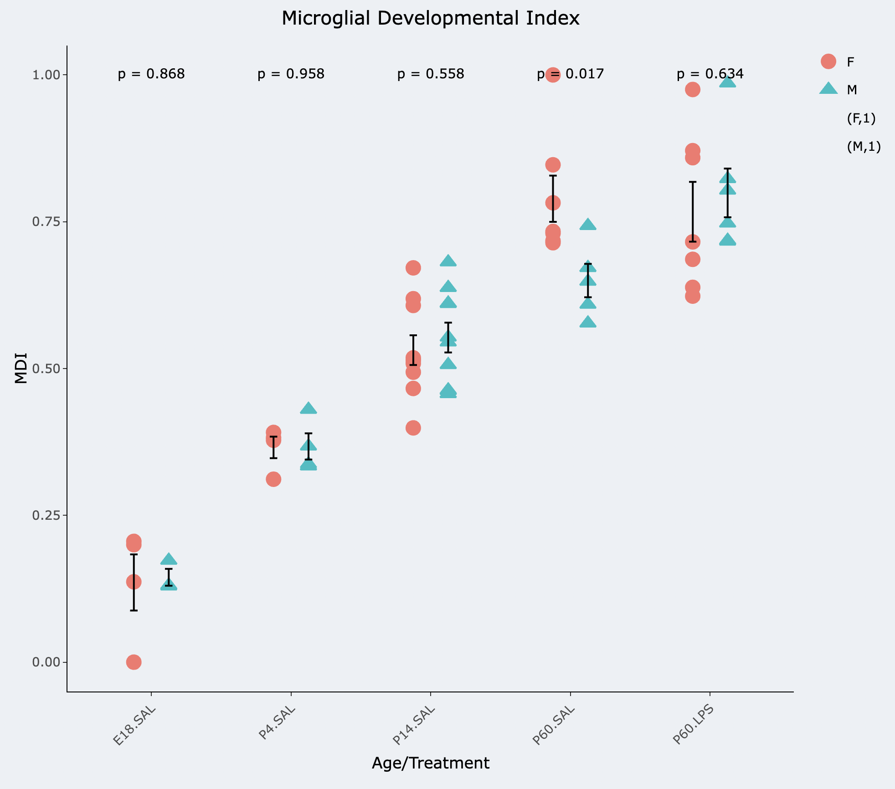
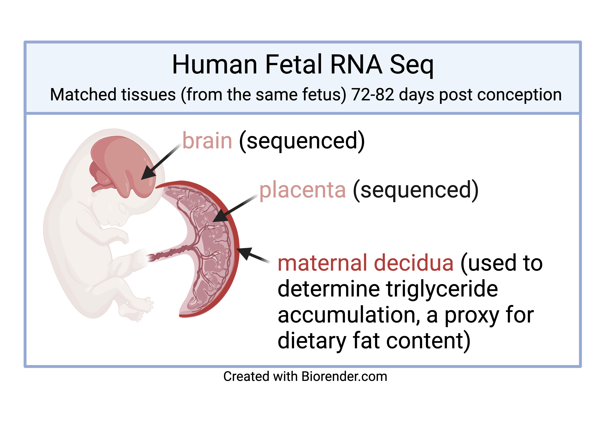

***I am passionate in my work to make data accessible and openly available to both other scientists and the public.*** There is a significant barrier in the field of big data. Many conventionally trained molecular biologists do not have the skills necessary to efficiently and effectively break down the big datasets that they are so frequently generating using new techniques such as single cell and spatial transcriptomics. As a mean to this end, I have worked on projects with members of my lab to help them generate simple, user-friendly websites to allow users to access and search RNA sequencing datasets that our lab has generated.

---

## Microglial Developmental RNASeq 

This website we created to show off the data from our previous publication showing that microglial transcriptomic profiles follow a defined developmental trajectory.The website allows searching of over 14,000 genes across isolated mouse microglia in males and females at 5 different ages. It also allows the user to run stats on sex differences and age differences, and export results as excel or csv datatables.

## Human Fetal RNASeq 

We created this website to coincide with the publication of our article in Nature Metabolism. The sequencing data was from human fetal tissue with matched brain and placenta samples. We performed bulk sequencing on the two sample types, and correlated their gene expression with maternal triglyceride levels measured from the maternal placenta. The website allows a searchable list of over 16,000 human genes correlating them with triglycerides in these samples. There is also and additional function for searching sex differences.

