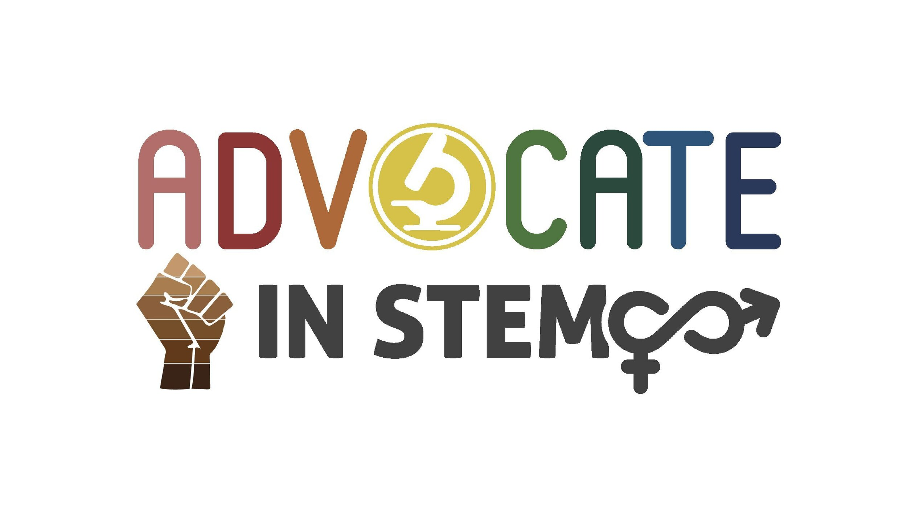
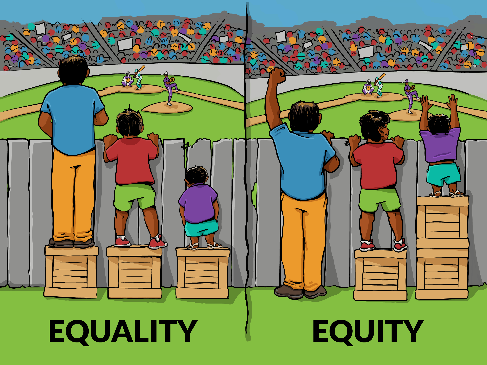

## Diversity in STEM is a requirement

The best insights come from a diverse team of scholars working together. With unique backgrounds and perspectives comes the most creative and impactful scientific ideas and progress. There is frankly no excuse for not creating a diverse and welcoming environment when it comes to science. I am committed to fostering an environment of learning, inclusivity, understanding, mutual respect, and equity.

> "1 + 1 can equal 3. But only if the two 1's are different. That is the bonus of diversity." ***-Scott Page, The Diversity Bonus.***

## Equity, not Equality

There exist many institutional disadvantages that have been propogated for many years, resulting in inequitable representation in STEM. As a mentor and a scientist, I strive to seek out opportunities that promote diversity, and give students from underrepresented backgrounds the exposures to science that are a given for students from traditionally white/wealthy backgrounds. Historically, members of our community with backgrounds different from my own (e.g. black, indigenous, persons of color), as well as women and LGBTQ+ folks, have not been given an equal voice in science. In addition to teaching Duke undergraduate students from underrepresented backgrounds both in and out of the lab, I have volunteered as a mentor for <a href="https://dibs.duke.edu/education/dune/" target="_blank">Duke University Neuroscience Experience</a>, which brings in students from Durham area high schools. This program has allowed me to mentor two high school students, Jasmine and Lillian, over the summer. It is through activities like these that I hope to increase experiences and exposures to Neuroscience research for all individuals.

> "For all of us, we agree that equity means that every member of our community should have the opportunity to achieve the same level of success, regardless of their starting point."  ***-Staci Bilbo, Graduate Advisor***

