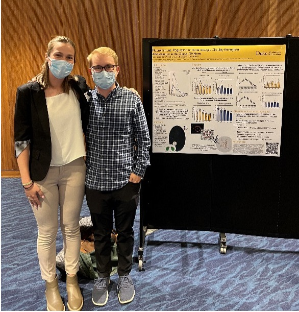
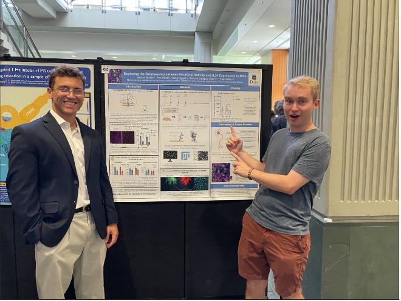

## Overview
---
I personally believe that getting students excited about class topics is critical to their engagement and eventual learning of the material. Thus, ***it is imperative to establish a level of enthusiasm in my students that is tangible, and extends beyond the classroom, since I believe this is essential to their engagement, acquisition, and future use of the material***. Moreover, I believe that if students are truly interested in the topics being discussed, they will be more likely to remember and use the material covered in class in their future endeavors. Finally, I strive to provide an inclusive, comfortable, and encouraging environment for students to learn and share ideas.

I have been fortunate enough to have a variety of teaching and mentoring opportunities as both an undergraduate and a Graduate student. I have primarily served as a teaching assistant for undergraduate classes such as introductory neuroscience and psychology, molecular neuroscience, physiological psychology, and biology. When I first stood in front of a classroom of students, I was definitely not the best version of a teacher I could be. One of my biggest weaknesses was that I often didn’t know when to shut up and assess student understanding through questions and group activities. These initial experiences in the classroom influenced my other guiding teaching principle: ***it is as important for the teacher to be learning from the class as it is for the students to be learning from the teacher***. Ultimately, if the students are having trouble with the class, something needs to change in the way the class is structured or in the way the material is presented. There is no perfect setup for any given discipline or curriculum. As a result of this, in my few years as a teaching assistant, my style and tactics have changed considerably based on feedback I have gotten and my experimenting with classroom that have worked (and others that haven’t).

## Formal Teaching: Learning from Students is Key to Success
---
My first formal teaching experience at Duke was for Molecular Neurobiology (Bio 223) in the Fall of 2020. During this course, in the middle of the COVID 19 pandemic, I independently ran discussion sections via Zoom. In these sessions, the students and I discussed the main points from assigned empirical article for the week, how the findings from the paper related to course content, and questions on the quizzes and worksheets. Since this position was full-remote, I adapted to using zoom tools such as breakout rooms, annotations, and polls to give the students ways to participate beyond unmuting and speaking up. As the weeks went on, and I continued to speak into the void of black squares with student names, ***I learned how important and valuable the student questions and participation were to their overall understanding and learning***. It became evident to me that their ability to engage with the material and with me predicted their success on the quizzes and exams. Thus, it was my job to create a safe, encouraging, and supportive environment for those interaction to take place. This realization led me to institute mini “office-hours” for 10-15 minutes after discussion each day for students to talk about anything and everything related to the course material. I couldn’t change the structure of the discussion sections halfway through the semester, but I could make myself available to the students in other ways in an informal setting. This specific change I made resulted in more students feeling comfortable engaging with me and the material, either in the somewhat large (25 person) zoom room, or after class in a 1-on-1 discussion.

> “I really enjoyed the team-based learning set up, it gave me the opportunity to meet new people and learn about some super cool and original ideas. I also enjoyed how involved the TAs were during the semester. Thank you for a great semester.”

Following my time with the molecular neurobiology students, I served as a teaching assistant for the “Biological Bases of Behavior” introductory neuroscience course at Duke for three consecutive semesters. In the spring of 2021 and the spring of 2022, I taught this course with Dr. Christina Williams, where my role was to lead smaller discussion sections where we took “deep dives” into a specific topic or technique related to neuroscience each week. Since the lecture portion of the class was introductory, much of the material the students were exposed to was very surface level. Thus, it was my job to find topics and develop lesson plans that gave the students additional, in-depth exposure to one new, cool, piece of neuroscience each week. I prepared weekly [PowerPoint presentations](https://drive.google.com/file/d/1VentiKFkVO14XRQSSedzXGJl9UJWO_dd/view) related to topics I know a lot about (microglia and development) as well as for topics I knew far less about (fMRI, sleep). ***This class hinged on getting new students (usually freshmen undergraduates with undecided majors) hooked on and excited about studying the brain. Thus, I took the time each week to tie in my research interests and experiences, which built rapport with the students, gave them context for the material, and helps them to understand how research intersects with core content.*** As a final project for this course, the students were required to take what they had learned about neuroscience research and methods in discussion section and write a novel research proposal. Through the semester, we have smaller assignments that let the students practice different components of what will be their eventual proposal, and they receive [extensive feedback](https://docs.google.com/document/d/1FN-eyMu24ikBe6zGcXb0C6girKs4pLERUpRGVNSGi-o/edit) from us as they go along. This gives the students the space to try out a new concept after they have been taught about said concept before they are eventually tested for their knowledge [(example final product)](https://docs.google.com/document/d/1EYAXlhfT4glgpQmruIs8BwjR0COCi-aDgrcttHXL4ak/edit). It was during this process that I adopted the three-tiered approach of teach, try, test, which I will talk about in more detail in the informal mentoring section.

> “Ben has been such an awesome TA and we are so appreciative of how he went above and beyond to support us”

During the fall of 2021, I taught Biological Bases of Behavior with Dr. Minna Ng, a professor of the practice in psychology who uses team-based learning techniques to encourage collaboration in the classroom. As a TA for this course, I was given the opportunity to present a 25-minute lecture in front of all 150 students introducing my favorite cell type in the brain, [microglia](https://drive.google.com/file/d/1u0wCHgMuE5vYUfgFCvVZbT9Kj7ziy8sx/view), and expose the students to the methods and questions involved in my own research. Following this talk, we received multiple student inquiries to work on an independent study in the Bilbo Lab! Furthermore, during Thursday class meetings each week I assisted with team-based learning material preparation, and generated [application activities](https://drive.google.com/file/d/19t3rUyA9zLO6Pm74e_iRYqvCfJuu2unC/view) geared toward group activities each week. These activities were created with the intention to spur discussion amongst the students about complex course concepts and were able to facilitate deep discussions of the material with minimal instructor intervention or traditional lecturing. ***I learned a LOT teaching in this class: by experiencing a completely different way to teaching the same material I had taught the prior semester; I was able to integrate the aspects of this style that worked well for the students (i.e. dedicated class time for structured group activities) while also identifying some other components that were maybe less useful (i.e. unstructured or vague application activities that went on for too long)*** [Full Course Evaluations from BioBases (F21)](https://docs.google.com/spreadsheets/d/1CJBN730R6TGG4y6EbLH2ytzxHXUNW5YnOXYAHo-Dc_M/edit#gid=1536989482)

> “such a good TA, Ben was. SO GOOD. Loved his slide sets, explanations of the material, and engaging in speaking style. Really enjoyed going to his classes.”

By the time I taught with Dr. Christina Williams again that following spring, I was eager to experiment with new techniques and discussion activities I had learned about from the team-based learning version with Dr. Ng. I also felt that I was prepared enough to introduce new topics to the curriculum that were likely to pique student interest and inform them of recent advances in neuroscience. I successfully persuaded Dr. Williams to allow me to develop a brand new lesson for discussion section on [“Psychedelics in Psychotherapy”](https://drive.google.com/file/d/1BmTMZ3DXUuFjFzNxmcKRFuui2bxIs55Z/view). This topic was of great interest to the students and allowed me to integrate basic course content (neurotransmitters and ion channels) with novel and exciting therapeutic research. ***While leading weekly discussions, I also experimented with new classroom assessment techniques such as pro/con grids and [think-pair-shares](https://docs.google.com/presentation/d/1p2m2-4d4uWOEmBho3fO_BtSG23z-7P-nVuOKLSQ7Xa8/edit#slide=id.p10) to bring students into class discussion early in the semester. These techniques allowed the students to make structured contributions following small-group or partner discussion.*** I also frequently used a range of techniques to assess student understanding. For example, I made QR code-linked surveys that the students filled out on their way into class to report their comfort with the material, as well as the “muddiest point” that they had about the article assigned for the week. These have been a great way for me to identify what is most important to go over, while also allowing the students to know that their learning is my top priority. [Full Student reviews from BioBases (S22)](https://drive.google.com/file/d/17SZNJC-tZHTCDPrSU_UuAX22BsjCRDIA/view)

> What would you like to say about this course to a student who is considering taking it in the future? 
>
> “Get Ben as a TA”

## Informal Mentoring: Teach, Try, Test Method
---
Teaching and mentoring outside of the classroom in informal settings such as the lab has helped me to develop as an instructor and come up with ways to assess student learning creatively.  In my graduate research lab, I have mentored undergraduate students in the technical and conceptual components associated with working in a neuroimmunology lab. ***When mentoring, I employ a similar approach to teaching as I’ve done in the classroom, where I first demonstrate to or teach the student whatever we are working on. I then let them student try it on their own with very few consequences (e.g. using test or practice samples) to allow them room for low stakes mistakes and encourage questions, and then once they are comfortable and confident in their abilities, I let them test their own questions or ideas.*** I have used this approach with four undergraduate students I have mentored in the lab, one of which, Anna (pictured right) , defended her <a href="https://docs.google.com/document/d/1rdijO1_U46xyIA8qRsO3Ax0IPKfSg4L-D38pcIhg7xY/edit" target="_blank">senior thesis</a> last spring, and another of which, Gabe (pictured left), is a current senior working on a thesis project with me. In addition to Duke undergraduates, I have also mentored high school students for the past two summers through the Duke University Neuroscience Experience (DUNE) program, which brings in students from traditionally underrepresented groups from Durham area high schools.  These mentoring opportunities have broadened my perspective on how to explain concepts and complex material to students with different levels of background knowledge (i.e. high school vs. undergraduate vs. graduate) and have helped me to continue to learn what methods are best for introducing students to neuroscience, while also encouraging their engagement and excitement for the material.

